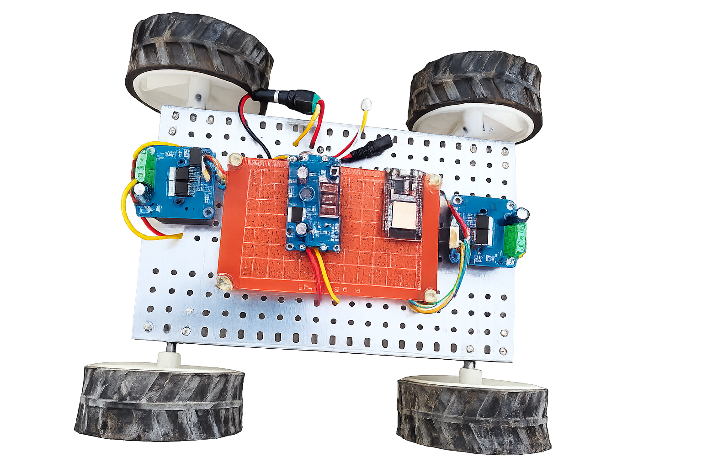

# ⚡ ECHO – Smart Robotic Vehicle


> High-Torque Bluetooth-Controlled Robotic Platform 🚗💨



---

## 🌐 Live Demo

🔗 https://ayanainaf.github.io/robo-car-portfolio/

---

## 📌 Overview

**ECHO V1** is a high-performance robotic vehicle engineered for real-world terrain navigation.
It integrates **embedded systems, power electronics, and mechanical design** into a compact system.

---

## 🎯 Problem

* Low torque under load
* Unstable power systems
* Poor control precision
* Heating & battery issues

---

## ✅ Solution

* ⚡ High-torque 4WD system
* 🔋 Efficient Li-ion power system
* 📡 Real-time Bluetooth control
* 🔧 Optimized structure

---

## 🚀 Features

* 📡 Bluetooth mobile control
* ⚡ Turbo PWM mode
* 🛞 Obstacle climbing
* 🔁 Differential drive
* 🧩 Modular design

---

## ⚙️ Tech Stack

* ESP32
* BTS7960 Motor Driver
* 100 RPM DC Motors
* 11.1V Li-ion Battery
* HTML + Tailwind + GSAP

---

## 🧠 Architecture

```
Mobile → Bluetooth → ESP32 → Driver → Motors
```

---

## 🎬 Demo

* 🚗 Car Movement
* 🎮 Controller UI Simulation

---

## 🖼️ Gallery

| Car                  | Controller                 |
| -------------------- | -------------------------- |
|  |  |

---

## ⚠️ Challenges

* Wiring instability
* Battery heating
* Voltage drop
* Mechanical friction
* Bluetooth delay

---

## 🔧 ECHO V2 (Upcoming)

* Smart PWM control
* Better battery system
* AI-based navigation
* IoT integration

---

## 👨‍💻 Developer

**Ayan Ainaf**

* 🔗 LinkedIn: https://www.linkedin.com/in/ayan-ainaf
* 💻 GitHub: https://github.com/AyanAinaf

---

## ⭐ Support

If you like this project:

* ⭐ Star
* 🍴 Fork
* 🚀 Share

---

## 📄 License

Licensed under the MIT License.
